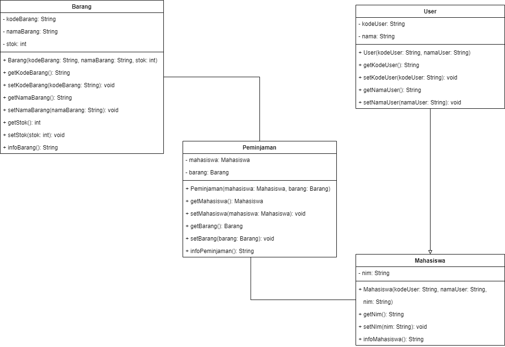
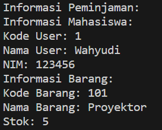

**Nama : Wahyudi** <br>
**Kelas: 2C** <br>
**NIM  : 2241720018** <br>
# Quiz 1

## 1. Class dan Object

### Apa yang dimaksud dengan "class" dalam pemrograman berorientasi objek?

**Jawab:** class adalah sebuah blueprint atau cetak biru yang digunakan untuk mendefinisikan objek. Class menggambarkan struktur atau template dari objek, termasuk atribut (variabel) dan metode (fungsi) yang dimiliki oleh objek tersebut.

### Bagaimana Anda mendefinisikan objek dari suatu class dalam bahasa pemrograman Java?

**Jawab:** Membuat objek dengan menggunakan operator new diikuti oleh constructor class tersebut.

#### Misalkan Anda memiliki class "Barang" dalam sistem informasi inventaris. Bagaimana Anda akan membuat objek "laptop" dari class tersebut?

**Jawab:** Berikut objek "laptop" dari class "Barang":
```java
Barang laptop = new Barang();
```
Objek tersebut dapat digunakan untuk menyimpan dan mengelola informasi terkait laptop.


## 2. Encapsulation

### Jelaskan konsep encapsulation dalam pemrograman berorientasi objek dan mengapa hal ini penting dalam pengembangan sistem informasi inventaris barang.

**Jawab:** Encapsulation adalah pembungkusan atau pengemasan atribut (variabel) dan metode (fungsi) ke dalam satu unit atau class. Hal ini penting dalam pengembangan sistem informasi inventaris barang karena memungkinkan Anda untuk melindungi data atau atribut dari akses langsung dan modifikasi yang tidak sah. Dengan cara ini, Anda dapat memastikan bahwa data tetap konsisten dan tidak rusak.

### Dalam konteks sistem informasi inventaris, sebutkan contoh atribut (variabel) yang harus di-encapsulate dan mengapa.

**Jawab:** Contoh atribut yang harus di-encapsulate dalam sistem informasi inventaris barang adalah:

- Nama barang: Untuk memastikan bahwa nama barang tetap konsisten dan sesuai dengan aturan yang ditetapkan.
- Kategori barang: Untuk mengontrol akses dan validasi saat mengubah atau mengambil kategori barang.
- Harga barang: Agar nilainya tidak dapat diubah secara sembarangan dan hanya dapat diakses melalui metode tertentu.
- Tanggal pembelian: Untuk menjaga integritas data dan memastikan bahwa tanggal pembelian tidak dapat diubah setelah transaksi selesai.
- Jumlah stok barang: Untuk menghindari perubahan yang tidak sah dan memastikan konsistensi stok.
- Status barang: Untuk memastikan bahwa status hanya dapat diubah sesuai dengan aturan yang ditetapkan.


## 3. Relasi Kelas

### Apa yang dimaksud dengan relasi antara kelas dalam pemrograman berorientasi objek?

**Jawab:** Hubungan atau interaksi antara dua atau lebih kelas. Beberapa contoh relasi antar kelas meliputi inheritance (pewarisan), association (asosiasi), aggregation (agregasi), dan composition (komposisi).

## Dalam sistem informasi inventaris barang, bagaimana Anda akan menggambarkan relasi antara kelas "Barang" dan kelas "Kategori"?

**Jawab:** Relasi antara kelas "Barang" dan kelas "Kategori" dengan menggunakan relasi agregation. artinya, kelas "Barang" memiliki kelas "Kategori" sebagai salah satu atribut-nya.

## 4. PBL

### Berdasarkan kasus sistem informasi inventaris barang, coba buat sebuah class sederhana beserta atribut dan metodenya yang menggambarkan suatu entitas dalam sistem tersebut (misalnya, class "Barang").

**Jawab:** Berikut class "Barang":

```java
public class Barang {
    private String kodeBarang;
    private String namaBarang;
    private int stok;

    public Barang(String kodeBarang, String nama,int stok) {
        this.kodeBarang = kodeBarang;
        this.namaBarang = nama;
        this.stok = stok;
    }

    public String getKodeBarang(){
        return kodeBarang;
    }

    public void setKodeBarang(String kodeBarang){
        kodeBarang = kodeBarang;
    }

    public String getNamaBarang() {
        return namaBarang;
    }

    public void setNamaBarang(String namaBarang){
        namaBarang = namaBarang;
    }

    public int getStok() {
        return stok;
    }

    public void setStok(int stok) {
        if (stok >= 0) {
            this.stok = stok;
        } else {
            System.out.println("Stok tidak valid.");
        }
    }

}
```

### Bagaimana Anda akan menggunakan encapsulation untuk melindungi atribut-atribut dalam class tersebut?

**Jawab:** Dalam class "Barang" di atas, atribut "nama," "harga," dan "stok" di-encapsulate dengan mengubah aksesnya menjadi private. sehingga hanya dapat diakses dari dalam class "Barang" itu sendiri. Ini berarti bahwa atribut-atribut ini tidak dapat diakses atau dimodifikasi langsung dari luar class.

### Gambarkan hierarki class atau hubungan antar class yang mungkin ada dalam sistem informasi inventaris barang di jurusan Teknologi Informasi. Berikan contoh relasi antar class (misalnya, inheritance atau association) dalam konteks tersebut.

**Jawab:**

**Class Utama:**
- Barang
- User

**Hierarki Class untuk User:**
- Mahasiswa: Merupakan subclass dari User yang mewakili mahasiswa dalam jurusan Teknologi Informasi.

**Relasi Inheritance:**
- Mahasiswa mewarisi atribut-atribut dasar dari User seperti kodeUser, namaUser, dan lain-lain.

**Relasi Association:**
- Setiap Barang dapat memiliki asosiasi dengan satu atau lebih User yang meminjam barang.

**UML:** <br>


**Kode Program:**
[Inventaris](Inventaris)

**Hasil Running:** <br>



