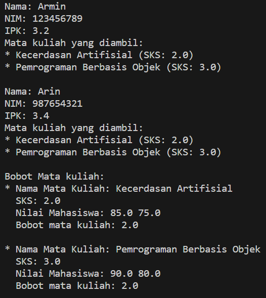

**Nama : Wahyudi**  
**Kelas: 2C**  
**NIM  : 2241720018**  
# KUIS 2

### 1. Kelas Mahasiswa:
- Buat kelas Mahasiswa dengan atribut nama, nim, dan nilai.
- Implementasikan metode hitung_ipk untuk menghitung IPK berdasarkan nilai.
- Overload metode hitung_ipk dengan versi baru yang menerima parameter
nilai_sks. Metode ini digunakan untuk menghitung IPK dengan memberikan
bobot tertentu pada setiap mata kuliah.

**Kode Program** 

[Soal 1](kuis2/Mahasiswa.java)

### 2. Kelas MataKuliah:
- Buat kelas MataKuliah dengan atribut nama_matakuliah, sks, dan
nilai_mahasiswa.
- Implementasikan metode hitung_bobot untuk menghitung bobot mata kuliah
berdasarkan nilai mahasiswa.
- Overload metode hitung_bobot dengan versi baru yang menerima parameter
bobot_mahasiswa. Metode ini digunakan untuk menghitung bobot mata kuliah
dengan memberikan bobot berdasarkan nilai mahasiswa yang mengambil mata
kuliah tersebut.

**Kode Program** 

[Soal 2](kuis2/MataKuliah.java)

### 3. Kelas Perwalian:
- Buat kelas Perwalian yang mengelola data mahasiswa dan mata kuliah yang
diambil.
- Tambahkan metode untuk menambahkan mahasiswa ke dalam perwalian.
- Tambahkan metode untuk menambahkan mata kuliah yang diambil oleh
mahasiswa.
- Tambahkan metode untuk mencetak seluruh data mahasiswa beserta mata
kuliah yang diambil.

**Kode Program** 

[Soal 3](kuis2/Perwalian.java)

### 4. Program Utama:
- Buat program utama yang menggunakan ketiga kelas tersebut.
- Tambahkan beberapa objek mahasiswa dan mata kuliah.
- Simulasikan proses perwalian, dengan menambahkan mahasiswa dan mata
kuliah yang diambil.
- Cetak hasil perwalian, termasuk IPK masing-masing mahasiswa dan bobot mata
kuliah yang diambil.

**Kode Program** 

[Soal 4](kuis2/Main.java)

**Hasil Running** 

