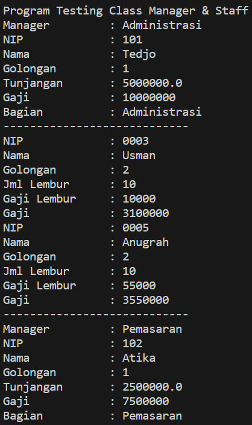
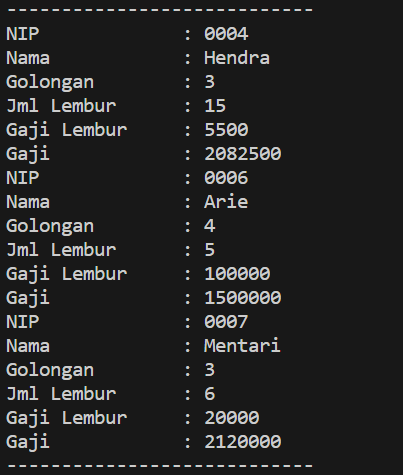
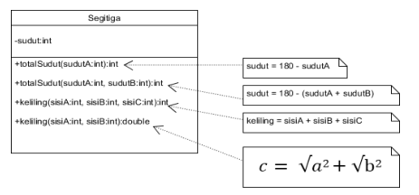
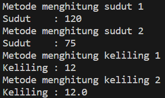
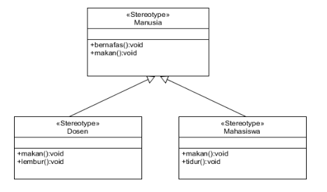
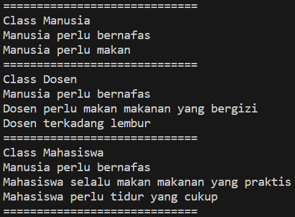

**Nama : Wahyudi** <br>
**Kelas: 2C** <br>
**NIM  : 2241720018** <br>
# JOBSHEET 9

## 3. Percobaan 1

**Kode Program**

[Percobaan 1](Percobaan1)

**Hasil Running**




## 4. Latihan

**PerkalianKu 1** 
```java
public class PerkalianKu {
    void perkalian(int a, int b) {
        System.out.println(a * b);
    }

    void perkalian(int a, int b, int c) {
        System.out.println(a * b * c);
    }
}

public static void main(String[] args) {
        PerkalianKu objek = new PerkalianKu();
        objek.perkalian(25, 43);
        objek.perkalian(34, 23, 56);
}
```

### 4.1. Dari source coding diatas terletak dimanakah overloading?

**Jawab:** Overloading terletak pada kelas PerkalianKu pada metode perkalian, di mana terdapat dua versi metode dengan nama yang sama tetapi dengan jumlah parameter yang berbeda.

### 4.2. Jika terdapat overloading ada berapa jumlah parameter yang berbeda?

**Jawab:** Pada kelas PerkalianKu, terdapat dua versi metode perkalian yang memiliki jumlah parameter yang berbeda. Yang pertama memiliki dua parameter (int a, int b), dan yang kedua memiliki tiga parameter (int a, int b, int c).

**PerkalianKu 2** 
```java
public class PerkalianKu {
    void perkalian(int a, int b) {
        System.out.println(a * b);
    }

    void perkalian(double a, double b) {
        System.out.println(a * b);
    }

public static void main(String[] args) {
        PerkalianKu objek = new PerkalianKu();
        objek.perkalian(25, 43);
        objek.perkalian(34.56, 23.7);
    }
}
```

### 4.3. Dari source coding diatas terletak dimanakah overloading?

**Jawab:** Overloading terletak pada kelas PerkalianKu pada metode perkalian, di mana terdapat dua versi metode dengan nama yang sama tetapi dengan tipe parameter yang berbeda.

### 4.4. Jika terdapat overloading ada berapa jumlah parameter yang berbeda?

**Jawab:**  Pada kelas PerkalianKu, terdapat dua versi metode perkalian yang memiliki tipe parameter yang berbeda. Yang pertama memiliki dua parameter bertipe int (int a, int b), dan yang kedua memiliki dua parameter bertipe double (double a, double b).

**Class Ikan** 
```java
public class Ikan {
    public void swim() {
        System.out.println("Ikan bisa berenang");
    }
}
```

**Class Piranha** 
```java
public class Piranha extends Ikan {
    public void swim() {
        System.out.println("Piranha bisa makan daging");
    }
}
```

**Class Fish** 
```java
public class Fish {
    public static void main(String[] args) {
        Ikan a = new Ikan();
        Ikan b = new Piranha();
        a.swim();
        b.swim();
    }
}
```

### 4.5. Dari source coding diatas terletak dimanakah overriding?

**Jawab:** Overriding terletak pada kelas Piranha yang merupakan turunan dari kelas Ikan pada metode swim.

### 4.6. Jabarkanlah apabila sourcoding diatas jika terdapat overriding?

**Jawab:** Overriding terjadi ketika kelas turunan (Piranha) mengimplementasikan kembali metode yang telah didefinisikan di kelas induk (Ikan). Dalam kasus ini, metode swim pada kelas Piranha menggantikan (override) metode swim yang ada di kelas Ikan.

## 5. Tugas

### 5.1. Overloading
#### Implementasikan konsep overloading pada class diagram dibawah ini :

**UML**



**Kode Program**

[Overloading](Tugas/Overloading)

**Hasil Running**



### 5.2. Overriding
#### Implementasikan class diagram dibawah ini dengan menggunakan teknik dynamic method dispatch :

**UML**



**Kode Program**

[Overriding](Tugas/Overriding)

**Hasil Running**

