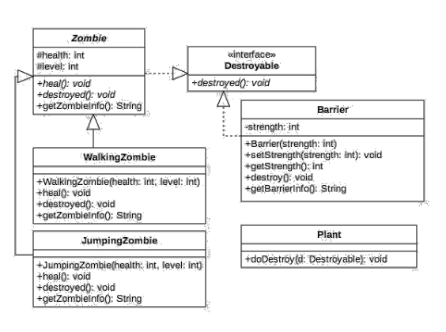
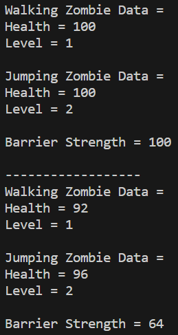

**Nama : Wahyudi**  
**Kelas: 2C**  
**NIM  : 2241720018**  
# JOBSHEET 12

## 4. Percobaan 1 
### 1. Class apa sajakah yang merupakan turunan dari class Employee?

**Jawab:** Class yang merupakan turunan dari class Employee adalah class IntershipEmployee dan class PermannetEmployee.

### 2. Class apa sajakah yang implements ke interface Payable?

**Jawab:** Class yang mengimplementasikan interface Payable adalah class PermanentEmployee dan class ElectricityBill

### 3. Perhatikan class Tester1, baris ke-10 dan 11. Mengapa e, bisa diisi dengan objek pEmp (merupakan objek dari class PermanentEmployee) dan objek iEmp (merupakan objek dari class InternshipEmployee)?

**Jawab:**  Hal ini terjadi karena polimorfisme, di mana objek dari subclass dapat diassign ke variabel superclass. Employee adalah superclass dari PermanentEmployee dan InternshipEmployee, sehingga objek dari keduanya dapat diassign ke variabel dengan tipe Employee.

### 4. Perhatikan class Tester1, baris ke-12 dan 13. Mengapa p, bisa diisi dengan objek pEmp (merupakan objek dari class PermanentEmployee) dan objek eBill (merupakan objek dari class ElectricityBill)?

**Jawab:** Hal ini terjadi karena polimorfisme, di mana objek dari class yang mengimplementasikan suatu interface dapat diassign ke variabel dengan tipe interface tersebut. class PermanentEmployee dan class ElectricityBill mengimplementasikan interface Payable, sehingga objek dari kedua class dapat diassign ke variabel dengan tipe Payable.

### 5. Coba tambahkan sintaks:   p = iEmp;   e = eBill;   pada baris 14 dan 15 (baris terakhir dalam method main)! Apa yang menyebabkan error?

**Jawab:** karena iEmp (objek dari class InternshipEmployee) tidak mengimplementasikan interface Payable, dan eBill (objek dari class ElectricityBill) bukan merupakan turunan dari class Employee. Sehingga, iEmp tidak dapat diassign ke variabel dengan tipe Payable dan eBill tidak dapat diassign ke variabel dengan tipe Employee.

### 6. Ambil kesimpulan tentang konsep/bentuk dasar polimorfisme!

**Jawab:** Polimorfisme memungkinkan objek dari subclass untuk dianggap sebagai objek dari superclass, baik melalui pewarisan maupun implementasi interface. Polimorfisme mempermudah penggunaan berbagai objek dengan tipe yang berbeda melalui variabel yang memiliki tipe superclass atau interface yang sesuai. Polimorfisme juga memungkinkan penggunaan metode yang dioverride oleh subclass saat objek tersebut dianggap sebagai objek dari superclass atau interface yang diimplementasikan.

## 5. Percobaan 2
### 1. Perhatikan class Tester2 di atas, mengapa pemanggilan e.getEmployeeInfo() pada baris 8 dan pEmp.getEmployeeInfo() pada baris 10 menghasilkan hasil sama?

**Jawab:** Karena pada saat runtime, metode yang dipanggil adalah metode yang sesuai dengan tipe objek aktual yang disimpan di dalam variabel. Meskipun variabel e dideklarasikan dengan tipe Employee, tetapi pada saat runtime, tipe objek yang sebenarnya adalah PermanentEmployee, sehingga metode yang dipanggil adalah metode yang dioverride oleh PermanentEmployee.

### 2. Mengapa pemanggilan method e.getEmployeeInfo() disebut sebagai pemanggilan method virtual (virtual method invication), sedangkan pEmp.getEmployeeInfo() tidak?

**Jawab:** 
- Pemanggilan method e.getEmployeeInfo() disebut sebagai pemanggilan method virtual karena metode yang dipanggil pada saat runtime dapat berubah tergantung pada objek yang sebenarnya ditunjuk oleh variabel e. Dalam konteks ini, metode getEmployeeInfo() dari class PermanentEmployee yang dioverride yang dipanggil.
- Pemanggilan pEmp.getEmployeeInfo() juga melibatkan overriding, tetapi tidak disebut virtual secara khusus karena objek yang ditunjuk oleh pEmp sudah diketahui pada saat kompilasi. 

### 3. Jadi apakah yang dimaksud dari virtual method invocation? Mengapa disebut virtual? 

**Jawab:** Virtual method invocation mengacu pada pemanggilan metode yang diputuskan secara dinamis pada waktu runtime berdasarkan objek yang sebenarnya, bukan pada waktu kompilasi. Istilah "virtual" menunjukkan bahwa pemilihan metode tersebut tidak terikat secara statis ke tipe variabel pada waktu kompilasi, melainkan tergantung pada objek yang sesungguhnya pada runtime. Ini memungkinkan untuk adanya overriding metode pada subclass, di mana subclass dapat menyediakan implementasi yang berbeda untuk metode yang telah dideklarasikan di superclass. 

## 6. Percobaan 3 

### 1. Perhatikan array e pada baris ke-8, mengapa ia bisa diisi dengan objek-objek dengan tipe yang berbeda, yaitu objek pEmp (objek dari PermanentEmployee) dan objek iEmp (objek dari InternshipEmployee)?

**Jawab:** Array e dapat diisi dengan objek-objek yang memiliki tipe yang berbeda, yaitu PermanentEmployee dan InternshipEmployee, karena keduanya merupakan subclass dari Employee. Dalam konsep polimorfisme, array atau koleksi objek dengan tipe superclass dapat menyimpan objek-objek dari subclassnya.

### 2. Perhatikan juga baris ke-9, mengapa array p juga biisi dengan objek-objek dengan tipe yang berbeda, yaitu objek pEmp (objek dari PermanentEmployee) dan objek eBill (objek dari ElectricityBilling)?

**Jawab:** Array p dapat diisi dengan objek-objek yang memiliki tipe yang berbeda, yaitu PermanentEmployee dan ElectricityBill, karena keduanya mengimplementasikan interface Payable. Dalam konsep polimorfisme, array atau koleksi objek dengan tipe interface dapat menyimpan objek-objek yang mengimplementasikan interface tersebut.

### 3. Perhatikan baris ke-10, mengapa terjadi error?

**Jawab:** karena array e2 dideklarasikan sebagai array dari tipe Employee, dan mencoba menyimpan objek ElectricityBill ke dalam array yang seharusnya hanya dapat menyimpan objek dari tipe Employee. Karena ElectricityBill bukan turunan dari Employee, maka tidak dapat disimpan secara langsung dalam array dengan tipe Employee.

## 7. Percobaan 4 
### 1. Perhatikan class Tester4 baris ke-7 dan baris ke-11, mengapa pemanggilan ow.pay(eBill) dan ow.pay(pEmp) bisa dilakukan, padahal jika diperhatikan method pay() yang ada di dalam class Owner memiliki argument/parameter bertipe Payable? Jika diperhatikan lebih detil eBill merupakan objek dari ElectricityBill dan pEmp merupakan objek dari PermanentEmployee?

**Jawab:** Pemanggilan ow.pay(eBill) dan ow.pay(pEmp) dapat dilakukan karena objek ElectricityBill dan PermanentEmployee mengimplementasikan interface Payable. Dalam konsep polimorfisme, objek dari kelas yang mengimplementasikan suatu interface dapat dianggap sebagai objek dari tipe interface tersebut. Oleh karena itu, objek eBill dan pEmp dapat disatukan dalam parameter yang memiliki tipe Payable.

### 2. Jadi apakah tujuan membuat argument bertipe Payable pada method pay() yang ada di dalam class Owner?

**Jawab:** Untuk memungkinkan metode tersebut menerima objek dari kelas-kelas yang mengimplementasikan interface Payable. Dengan cara ini, metode pay() dapat digunakan untuk mengelola berbagai jenis objek yang memiliki kemampuan untuk memberikan informasi pembayaran (getPaymentAmount()), tanpa harus mengetahui detail implementasi kelas tersebut.

### 3. Coba pada baris terakhir method main() yang ada di dalam class Tester4 ditambahkan perintah ow.pay(iEmp);Mengapa terjadi error?

**Jawab:** Karena class InternshipEmployee tidak mengimplementasikan interface Payable. Oleh karena itu, objek dari InternshipEmployee tidak dapat diserahkan sebagai argumen kepada metode pay() yang mengharapkan objek bertipe Payable.

### 4. Perhatikan class Owner, diperlukan untuk apakah sintaks p instanceof ElectricityBill pada baris ke-6?

**Jawab:** Untuk memeriksa apakah objek yang diwakili oleh variabel p adalah instance dari kelas ElectricityBill. 

### 5. Perhatikan kembali class Owner baris ke-7, untuk apakah casting objek disana (ElectricityBill eb =(ElectricityBill) p) diperlukan? Mengapa objek p yang bertipe Payable harus di-casting ke dalam objek eb yang bertipe ElectricityBill?

**Jawab:** Karena pada saat kompilasi, tipe variabel p dianggap sebagai tipe Payable. Namun, pada waktu runtime, kita tahu bahwa objek yang sesungguhnya adalah ElectricityBill. Oleh karena itu, kita menggunakan casting untuk memberitahu kompilator bahwa kita yakin objek tersebut adalah instance dari ElectricityBill. 

## 8. Tugas

### Buat program dari class diagram di bawah ini!

**Kode Program**

[Tugas](Tugas)

**Hasil Running**

