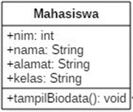

**Percobaan 1: Membuat Class Diagram**  
Studi Kasus 1:  
Dalam suatu perusahaan salah satu data yang diolah adalah data karyawan. Setiap karyawan memiliki id, nama, jenis kelamin, jabatan, jabatan, dan gaji. Setiap mahasiswa juga bisa menampilkan data diri pribadi dan melihat gajinya.  
1. Gambarkan desain class diagram dari studi kasus 1!  
   Jawab:  
   
2. Sebutkan Class apa saja yang bisa dibuat dari studi kasus 1!  
   Jawab:  
   Karyawan
3. Sebutkan atribut beserta tipe datanya yang dapat diidentifikasi dari masing-masing class dari studi kasus 1!  
   Jawab:  
   Atribut Id dengan tipe data integer, Atribut nama dengan tipe data String, Atrbut jenisKelamin dengan tipe data String, Atribut jabatan dengan tipe data String, dan Atrbut  gaji dengan tipe data integer
4. Sebutkan method-method yang sudah anda buat dari masing-masing class pada studi kasus 1!  
   Jawab:  
   Method tampilBiodata() dengan tipe data void, dan Method tampilGaji() dengan tipe data void

**Percobaan 2: Membuat dan mengakses anggota suatu class**  
Studi Kasus 2:  
Perhatikan class diagram dibawah ini. Buatlah program berdasarkan class diagram tersebut!  
  
7. Jelaskan pada bagian mana proses pendeklarasian atribut pada program diatas!  
   Jawab:  
   
   Atribut dideklarasikan di class Mahasiswa dengan akses public. Dengan deklarasi ini, setiap objek dari kelas Mahasiswa akan memiliki empat atribut: nim, nama, alamat, dan kelas. Atribut-atribut ini akan digunakan untuk menyimpan informasi tentang setiap mahasiswa.  
8. Jelaskan pada bagian mana proses pendeklarasian method pada program diatas!  
   Jawab:  
   
   Method tampilBiodata() dideklarasikan di class Mahasiswa dengan akses public dan tidak mengembalikan nilai (void). Method ini mencetak biodata mahasiswa.  
9. Berapa banyak objek yang di instansiasi pada program diatas!  
   Jawab:  
   Satu.  
10. Apakah yang sebenarnya dilakukan pada sintaks program “mhs1.nim=101”?  
   Jawab:  
   Dilakukan inisialisasi atau pengisian nilai dari atribut nim yang dimiliki oleh objek mhs1.  
11. Apakah yang sebenarnya dilakukan pada sintaks program “mhs1.tampilBiodata()”?  
   Jawab:  
   Memanggil method tampilBiodata() pada class Mahasiswa kemudian akan mencetak biodata mahasiswa seperti NIM, nama, alamat, dan kelas yang dimiliki oleh objek mhs1.  
12. Instansiasi 2 objek lagi pada program diatas!  
   Jawab:  
     
**Percobaan 3: Menulis method yang memiliki argument/parameter dan memiliki return**  
7. Apakah fungsi argumen dalam suatu method?  
   Jawab:  
   Menambah nilai inputan pada saat method dipanggil.  
8. Ambil kesimpulan tentang kegunaan dari kata kunci return , dan kapan suatu method harus memiliki return!  
   Jawab:  
   return digunakan jika memerlukan suatu nilai balik, contoh menghitung stok setelah dilakukan penambahan stok.  <br3>
**Tugas**  
1. Suatu toko persewaan video game salah satu yang diolah adalah peminjaman, dimana data yang dicatat ketika ada orang yang melakukan peminjaman adalah id, nama member, nama game, dan harga yang harus dibayar. Setiap peminjaman bisa menampilkan data hasil peminjaman dan harga yang harus dibayar. Buatlah class diagram pada studi kasus diatas!  
Penjelasan:  
Harga yang harus dibayar diperoleh dari lama sewa x harga.  
Diasumsikan 1x transaksi peminjaman game yang dipinjam hanya 1 game saja.  
Jawab:  
  
2. Buatlah program dari class diagram yang sudah anda buat di no 1!  
Jawab:  
<a href="PeminjamanGame">Tugas 2</a>
3. Buatlah program sesuai dengan class diagram berikut ini:  
  
Jawab:  
<a href="Lingkaran">Tugas 3</a>
4. Buatlah program sesuai dengan class diagram berikut ini:  
Deskripsi / Penjelasan :  
Nilai atribut hargaDasar dalam Rupiah dan atribut diskon dalam %  
Method hitungHargaJual() digunakan untuk menghitung harga jual dengan
perhitungan berikut ini:  
harga jual = harga dasar – (diskon x harga dasar)  
Method tampilData() digunakan untuk menampilkan nilai dari kode, namaBarang, hargaDasar, diskon dan harga jual.  
  
Jawab:  
<a href="BarangTugas">Tugas 4</a>