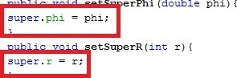
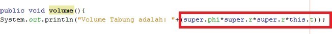
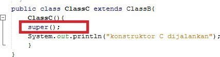
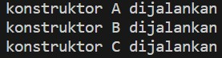
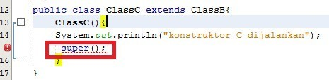
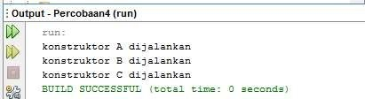
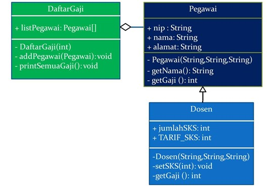
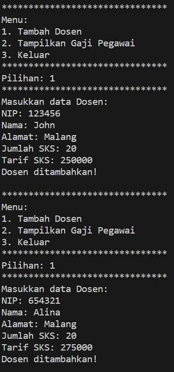
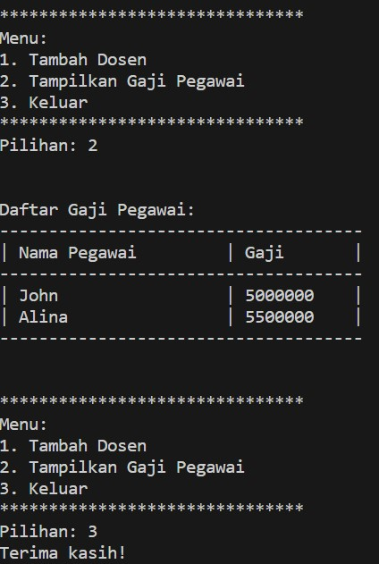

**Nama : Wahyudi** <br>
**Kelas: 2C** <br>
**NIM  : 2241720018** <br>
# Quiz 1

## 1. Extends

### 1. Pada percobaan 1 diatas program yang dijalankan terjadi error, kemudian perbaiki sehingga program tersebut bisa dijalankan dan tidak error!

**Jawab:** Memperbaiki program agar dapat dijalankan tanpa error dapat menggunakan pewarisan (extends) untuk mewarisi properti dari ClassA ke ClassB.

```java
public class ClassB extends ClassA {
    public int z;

    public void getNilaiZ() {
        System.out.println("nilai Z:" + z);
    }

    public void getJumlah() {
        System.out.println("jumlah:" + (x + y + z));
    }
}

```

### 2. Jelaskan apa penyebab program pada percobaan 1 ketika dijalankan terdapat error!

**Jawab:** Tidak dapat mengakses langsung atribut x dan y serta metode getNilai() melalui objek hitung (objek ClassB).

## 2. Hak Akses

### 1. Pada percobaan 2 diatas program yang dijalankan terjadi error, kemudian perbaiki sehingga program tersebut bisa dijalankan dan tidak error!

**Jawab:** Memperbaiki program agar dapat dijalankan tanpa error dapat menggunakan pewarisan (extends) untuk mewarisi properti dari ClassA ke ClassB dan membuat metode getter untuk masing-masing atribut.

**ClassA** 
```java
public class ClassA {
    private int x;
    private int y;

    public void setX(int x) {
        this.x = x;
    }

    public int getX() {
        return x;
    }

    public void setY(int y) {
        this.y = y;
    }

    public int getY() {
        return y;
    }

    public void getNilai() {
        System.out.println("nilai X:" + x);
        System.out.println("nilai Y:" + y);
    }
}
```

**ClassB** 
```java
public class ClassB extends ClassA {
    private int z;

    public void setZ(int z) {
        this.z = z;
    }

    public int getZ() {
        return z;
    }

    public void getNilaiZ() {
        System.out.println("nilai Z:" + getZ());
    }

    public void getJumlah() {
        System.out.println("jumlah:" + (getX() + getY() + getZ()));
    }
}
```

### 2. Jelaskan apa penyebab program pada percobaan 2 ketika dijalankan terdapat error!

**Jawab:** 
- Tidak dapat mengakses langsung atribut x dan y serta metode getNilai() melalui objek hitung (objek ClassB).
- Tidak dapat mewariskan atribut dengan access modifier private dari ClassA ke ClassB.

## 3. Super

### 1. Jelaskan fungsi “super” pada potongan program berikut di class Tabung!



**Jawab:** 
- super.phi = phi <br>
  mengambil nilai dari variabel phi yang didefinisikan di class Bangun dan menggantinya dengan nilai yang diberikan sebagai parameter kepada method setSuperPhi(double phi). 
- super.r = r <br>
  mengambil nilai dari variabel r yang didefinisikan di class Bangun dan menggantinya dengan nilai yang diberikan sebagai parameter kepada method setSuperR(int r).

### 2. Jelaskan fungsi “super” dan “this” pada potongan program berikut di class Tabung!



**Jawab:** 
- super untuk mengakses variabel-variabel yang didefinisikan di superclass. 
- this ntuk mengakses variabel yang didefinisikan di class saat ini (class Tabung).

### 3. Jelaskan mengapa pada class Tabung tidak dideklarasikan atribut “phi” dan “r” tetapi class tersebut dapat mengakses atribut tersebut!

**Jawab:** Karena kelas Tabung adalah subclass dari kelas Bangun, dan atribut phi dan r dideklarasikan sebagai protected di dalam kelas Bangun. Ketika sebuah atribut dideklarasikan sebagai protected dalam sebuah kelas, atribut tersebut dapat diakses oleh kelas-kelas yang merupakan subclass dari kelas tersebut.

## 4. Super Contsructor

### 1. Pada percobaan 4 sebutkan mana class yang termasuk superclass dan subclass, kemudian jelaskan alasannya!

**Jawab:** 
- ClassA <br>
  ClassA merupakan superclass dari ClassB karena ClassB meng-extend ClassA. 
- ClassB
  - ClassB merupakan subclass dari ClassA Karena ClassB mewarisi dari ClassA.
  - selain itu, ClassB merupakan superclass dari ClassB karena ClassC meng-extend ClassB. 
- ClassC <br>
  ClassC merupakan subclass dari ClassC Karena ClassA mewarisi dari ClassB.

### 2. Ubahlah isi konstruktor default ClassC seperti berikut:



### Tambahkan kata super() di baris Pertaman dalam konstruktor defaultnya. Coba jalankan kembali class Percobaan4 dan terlihat tidak ada perbedaan dari hasil outputnya!

**Jawab:** 



### 3. Ublah isi konstruktor default ClassC seperti berikut:



### Ketika mengubah posisi super() dibaris kedua dalam kontruktor defaultnya dan terlihat ada error. Kemudian kembalikan super() kebaris pertama seperti sebelumnya, maka errornya akan hilang. 
### Perhatikan hasil keluaran ketika class Percobaan4 dijalankan. Kenapa bisa tampil output seperti berikut pada saat instansiasi objek test dari class ClassC



### Jelaskan bagaimana urutan proses jalannya konstruktor saat objek test dibuat!

**Jawab:** Saat objek test dari kelas ClassC dibuat, proses jalannya konstruktor berlangsung dalam urutan berikut:
1. Pertama, konstruktor dari kelas ClassA dipanggil karena kelas ClassB dan ClassC adalah turunan dari ClassA. Jadi, output pertama yang akan Anda lihat adalah: <br>
konstruktor A dijalankan
2. Setelah konstruktor kelas ClassA selesai dijalankan, konstruktor kelas ClassB dipanggil karena ClassC adalah turunan dari ClassB. Output kedua yang akan Anda lihat adalah: <br>
konstruktor B dijalankan
3. Akhirnya, konstruktor dari kelas ClassC sendiri dipanggil. Output ketiga yang akan Anda lihat adalah: <br>
konstruktor C dijalankan

### 4. Apakah fungsi super() pada potongan program dibawah ini di ClassC!


**Jawab:** super() digunakan untuk menjalankan konstruktor dari kelas induk (ClassB) sebelum menjalankan konstruktor kelas saat ini (ClassC) 

## TUGAS
### Buatlah sebuah program dengan konsep pewarisan seperti pada class diagram berikut ini. Kemudian buatlah instansiasi objek untuk menampilkan data nama pegawai dan gaji yang didapatkannya.

**UML**



**Kode Program**

[Tugas](Tugas)

**Hasil Running**



