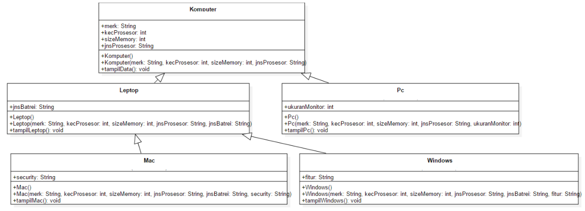
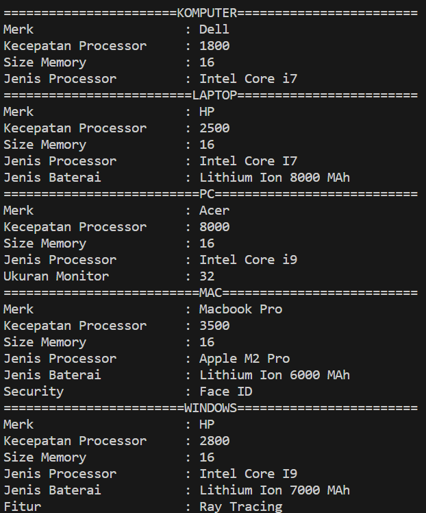

**Nama : Wahyudi** <br>
**Kelas: 2C** <br>
**NIM  : 2241720018** <br>
# JOBSHEET 6

## Percobaan 1

### 1. Sebutkan class mana yang termasuk super class dan sub class dari percobaan 1 diatas!

**Jawab:** class Karyawan adalah super class dan class Manager dan class Staff adalah sub class.

### 2. Kata kunci apakah yang digunakan untuk menurunkan suatu class ke class yang lain?

**Jawab:** Kata kunci extends digunakan untuk menurunkan suatu class ke class yang lain.

### 3. Perhatikan kode program pada class Manager, atribut apa saja yang dimiliki oleh class tersebut? Sebutkan atribut mana saja yang diwarisi dari class Karyawan!

**Jawab:** 
Class Manager memiliki atribut tunjangan. Class Manager mewarisi atribut nama, alamat, jk, umur, dan gaji dari class Karyawan.

### 4. Jelaskan kata kunci super pada potongan program dibawah ini yang terdapat pada class Manager!
```java
System.out.println("Total Gaji      = " + (super.gaji + tunjangan));
```
**Jawab:** Kata kunci super pada potongan program tersebut digunakan untuk mengakses atribut gaji dari class induk, yaitu class Karyawan.

### 5. Program pada percobaan 1 diatas termasuk dalam jenis inheritance apa? Jelaskan alasannya!

**Jawab:** Program pada percobaan 1 menggunakan jenis pewarisan hierarchical inheritance, di mana superclass Karyawan memiliki lebih dari satu subclass, yaitu Manager dan Staff, yang mewarisi atribut dan metodenya.

## Percobaan 2

### 1. Berdasarkan class diatas manakah yang termasuk single inheritance dan mana yang termasuk multilevel inheritance?

**Jawab:** 
- Single inheritance: hubungan antara class Karyawan dan class Manager.
- Multilevel inheritance: hubungan antara class Karyawan, Staff, StaffHarian, dan StaffTetap.

### 2. Perhatikan kode program class StaffTetap dan StaffHarian, atribut apa saja yang dimiliki oleh class tersebut? Sebutkan atribut mana saja yang diwarisi dari class Staff!

**Jawab:** Class StaffTetap memiliki atribut golongan dan asuransi. class StaffHarian memiliki atribut jmlJamKerja. Class StaffTetap dan StaffHarian mewarisi atribut nama, alamat, jk, umur, gaji, lembur, dan potongan dari class Staff.

### 3. Apakah fungsi potongan program berikut pada class StaffHarian

```java
super(lembur, potongan, nama, alamat, jk, umur, gaji);
```

**Jawab:** Potongan program tersebut berfungsi untuk memanggil constructor dari class induk, yaitu class Staff.

### 4. Apakah fungsi potongan program berikut pada class StaffHarian
```java
super.tampilDataStaff();
```

**Jawab:** Potongan program tersebut berfungsi untuk memanggil method tampilDataStaff() dari class induk, yaitu class Staff.

### 5. Perhatikan kode program dibawah ini yang terdapat pada class StaffTetap 
```java
System.out.println("Gaji Bersih     = " + (gaji + lembur - potongan - asuransi));
```
### Terlihat dipotongan program diatas atribut gaji, lembur dan potongan dapat diakses langsung. Kenapa hal ini bisa terjadi dan bagaimana class StaffTetap memiliki atribut gaji, lembur, dan potongan padahal dalam class tersebut tidak dideklarasikan atribut gaji, lembur, dan potongan?

**Jawab:** class StaffTetap dapat mengakses atribut gaji, lembur, dan potongan langsung karena class StaffTetap mewarisi atribut tersebut dari class Staff.

## TUGAS

### Buatlah sebuah program dengan konsep pewarisan seperti pada class diagram berikut ini. Kemudian buatlah instansiasi objek untuk menampilkan data pada class Mac, Windows dan Pc!.

**UML**



**Kode Program**

[Tugas](Tugas)

**Hasil Running**


