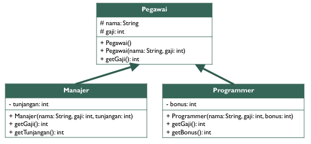
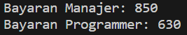
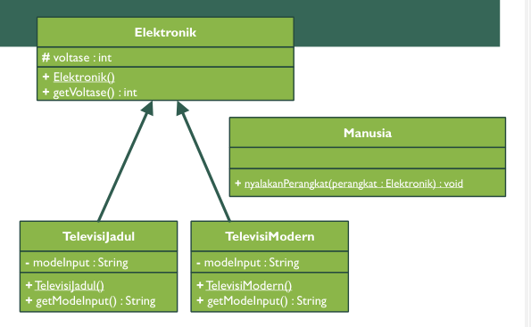
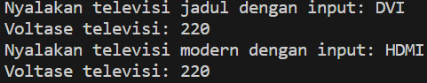

**Nama : Wahyudi**  
**Kelas: 2C**  
**NIM  : 2241720018**  
# Latihan

## EXERCISE 1

### Buatlah program dari class diagram dibawah:

**UML**

**Kode Program** 

[Exercise 1](exercise1)

**Hasil Running** 

## EXERCISE 2

### Buatlah program dari class diagram dibawah:

**UML**

**Kode Program** 

[Exercise 2](exercise2)

**Hasil Running** 

