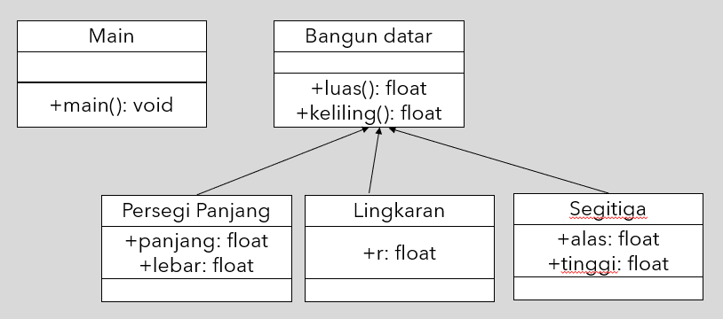

**Nama : Wahyudi**  
**Kelas: 2C**  
**NIM  : 2241720018**  

# Soal 1
### UML:

### Class BangunDatar
**Kode Program:**
[Bangun Datar](soal1/BangunDatar.java)
### Class PersegiPanjang
**Kode Program:**
[Persegi Panjang](soal1/PersegiPanjang.java)
### Class Lingkaran
**Kode Program:**
[Lingkaran](soal1/Lingkaran.java)
### Class Segitiga
**Kode Program:**
[Segitiga](soal1/Segitiga.java)
### Class MainBangunDatar
**Kode Program:**
[Main Bangun Datar](soal1/MainBangunDatar.java)

### Hasil Running:

