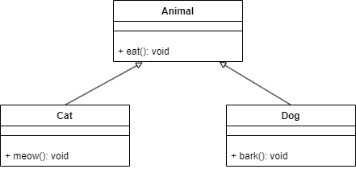
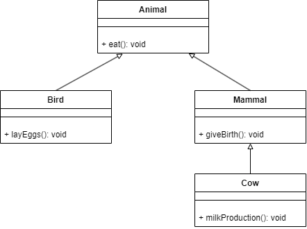

**Nama : Wahyudi**  
**Kelas: 2C**  
**NIM  : 2241720018**  
# Latihan

## Hierarchical Inheritance

### Program simulasi hewan memiliki kelas dasar "Animal" yang memiliki metode "eat". Kelas "Animal" memiliki dua kelas turunan, yaitu kelas "Cat" dengan metode tambahan "meow" untuk menggambarkan perilaku kucing dan kelas "Dog" dengan metode tambahan "bark" untuk menggambarkan perilaku anjing.

**Jawab:** 

**UML** 

## Hybrid Inheritance

### Program simulasi hewan memiliki kelas dasar "Animal" yang memiliki metode "eat". Kelas "Animal" memiliki dua kelas turunan, yaitu kelas "Bird" dengan metode tambahan "layEggs" untuk menggambarkan perilaku kucing dan kelas "Mammal" dengan metode tambahan "giveBirth" untuk menggambarkan perilaku mamalia. Kemudian kelas "Mammal" memiliki kelas turunan, yaitu kelas "Cow" dengan metode tambahan "milkProduction" untuk menggambarkan perilaku sapi.

**Jawab:** 

**UML** 

