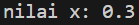
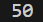
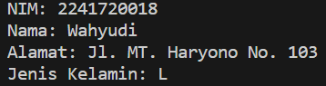
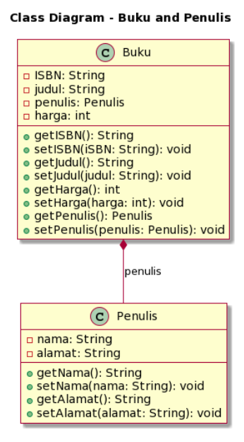
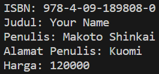

**Nama : Wahyudi** <br>
**Kelas: 2C** <br>
**NIM  : 2241720018** <br>
# UTS

## 1. Penulisan Class

### Berdasarkan contoh class ClassA di bawah ini, jelaskan apakah penulisan source code pada contoh class tersebut sudah benar. Jika tidak, apa yang perlu diperbaiki?
```java
public class ClassA {
    float f1 = 0.15f;

    float hitung() {
        float x = 2f * f1; 
    }
}
```

**Jawab:** Source code pada contoh class tidak lengkap karena method hitung() dideklarasikan untuk mengembalikan nilai tipe data float, namun tidak mengembalikan nilai apapun. Oleh karena itu, perlu ditambahkan pernyataan return untuk mengembalikan nilai float dari method tersebut. <br>

**Perbaikan class ClassA**
```java
public class ClassA {
    float f1 = 0.15f;

    float hitung() {
        float x = 2f * f1;
        // Mengembalikan nilai x
        return x; 
    }
}
```
**Hasil running**



## 2. Perhitungan Jumlah Elemen Array 2 Dimensi

### Pada class SoalArray1, terdapat array 2 dimensi dengan ukuran 3x3. Tuliskan code Java untuk menghitung jumlah total elemen array tersebut dengan menggunakan perulangan.
```java
public class SoalArray1 {
    public static void main(String[] args) {
        int[][] arrayInt = { { 1, 1, 4 }, { 2, 1, 2 }, { 3, 2, 1 } };
        // hitung jumlah elemen array 2 dimensi
        // gunakan perulangan
    }
}
```

**Jawab:**
```java
public class SoalArray1 {
    public static void main(String[] args) {
        int[][] arrayInt = { { 1, 1, 4 }, { 2, 1, 2 }, { 3, 2, 1 } };
        // Inisialisasi variabel jumlahElemen
        int jumlahElemen = 0;

        // Menghitung jumlah elemen array
        for (int i = 0; i < arrayInt.length; i++) { // Perulangan pertama (i) untuk mengakses baris
            for (int j = 0; j < arrayInt[i].length; j++) { // Perulangan kedua (j) untuk mengakses elemen di dalam baris
                jumlahElemen++; // Setiap kali perulangan j dieksekusi, jumlahElemen bertambah satu
            }
        }

        // Mencetak jumlah elemen array
        System.out.println("Jumlah elemen array 2 dimensi: " + jumlahElemen);
    }
}
```

**Hasil running**


## 3. Pewarisan Atribut dan Method

### Pada source code yang diberikan, class ClassY merupakan turunan dari class Class. Sebutkan atribut dan method apa saja yang diwarisi oleh ClassY dari kelas induknya (class Class). Jelaskan juga apa output dari code yang ditulis pada class ClassY dan bagaimana nilai tersebut diperoleh.

```java
public class Class {
    int a = 2;
    int x = 0;

    int hitung() {
        x = x + 5 * a;
        return x;
    }
}
```

```java
public class ClassY extends Class {
    int b = 5;
    int y = 0;

    int hitungY() {
        y = hitung() * b;
        return y;
    }

    public static void main(String[] args) {
        ClassY cy = new ClassY();
        System.out.println(cy.hitungY());
    }
}
```
**Jawab:** ClassY mewarisi atribut a dengan nilai 2 dan x dengan nilai 0 dari kelas induknya, Class. <br>
Di dalam method hitungY(), terjadi beberapa operasi:
1. Pertama, metode hitung() dari kelas induk, yaitu Class, dipanggil. Dalam metode hitung(), nilai x akan diubah menjadi x + 5 * a. Oleh karena itu, sekarang x menjadi x + 5 * a, yaitu 0 + 5 * 2, sehingga nilai x menjadi 10.

2. Kemudian, metode hitungY() mengalikan nilai x yang telah diubah dengan atribut b, yaitu 10 * 5, sehingga nilai y menjadi 50.

3. Hasil akhir dari metode hitungY() adalah 50.

Sehingga, output dari kode yang ditulis pada ClassY adalah: <br>


## 4. Class Mahasiswa dengan Constructor

###  Dalam class Mahasiswa, lengkapi code dengan:
### a. Menambahkan constructor untuk mengisi atribut nim, nama, alamat, dan jenisKelamin. 
### b. Membuat objek mahasiswa dan mengisi atribut nim, nama, alamat, dan jenisKelamin melalui constructor.
```java
public class Mahasiswa {
    String nim, nama, alamat;
    char jeniskelamin;

    // a. Tambahkan constructor
    // Gunakan constructor untuk
    // Mengisi atribut nim, nama, alamat, jenisKelamin

    public static void main(String[] args) {
        // b. Buat objek mahasiswa
        // Isi atribut nim, nama, alamat, jenisKelamin
        // lewat constructor
    }
}
```
**Jawab:**
``` java
public class Mahasiswa {
    String nim, nama, alamat;
    char jeniskelamin;

    // construtor class Mahasiswa
    Mahasiswa(String nim, String nama, String alamat, char jenisKelamin) {
        this.nim = nim;
        this.nama = nama;
        this.alamat = alamat;
        this.jeniskelamin = jenisKelamin;
    }

    public static void main(String[] args) {
        // Instansiasi objek wahyudi
        Mahasiswa wahyudi = new Mahasiswa("2241720018", "Wahyudi", "Jl. MT. Haryono No. 103", 'L');

        // Mencetak objek wahyudi
        System.out.println("NIM: " + wahyudi.nim);
        System.out.println("Nama: " + wahyudi.nama);
        System.out.println("Alamat: " + wahyudi.alamat);
        System.out.println("Jenis Kelamin: " + wahyudi.jeniskelamin);
    }
}
```

**Hasil running**



## 5. OOP Buku -> Penulis

### Perhatikan class diagram berikut dan Buatlah Source code dalam Bahasa java berdasarkan class diagram tersebut


**Jawab:**

[Soal5](Soal5)

**Hasil running**


